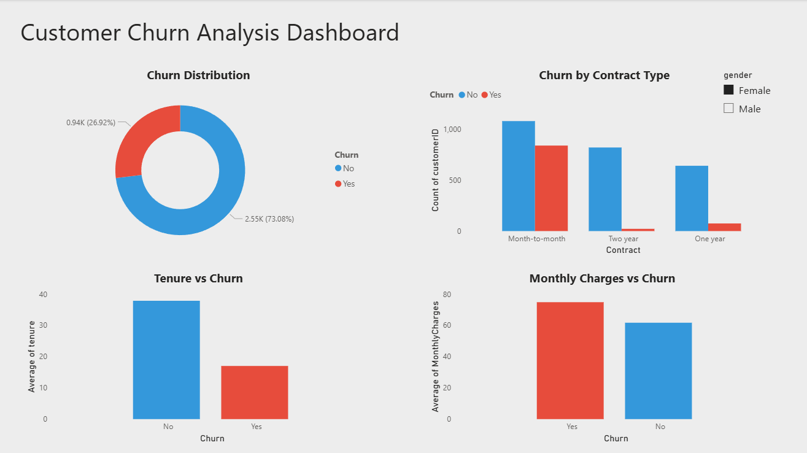

# 📊 Customer Churn Analysis

## 📌 Overview
This project analyzes customer churn behavior using Python and Power BI to identify key factors affecting customer retention.

## 🛠 Tools Used
- Python (Pandas, Matplotlib, Seaborn)
- Power BI

## 📊 Dashboard

## 🔍 Key Insights
- Customers with higher monthly charges are more likely to churn
- New customers (low tenure) have higher churn rates
- Month-to-month contract customers churn the most

## 🎯 Conclusion
Pricing, tenure, and contract type significantly impact customer churn. Businesses can reduce churn by focusing on customer retention strategies.

## 📁 Files
- analysis.ipynb → Data analysis in Python
- dashboard.pbix → Power BI dashboard
- dashboard.png → Dashboard preview